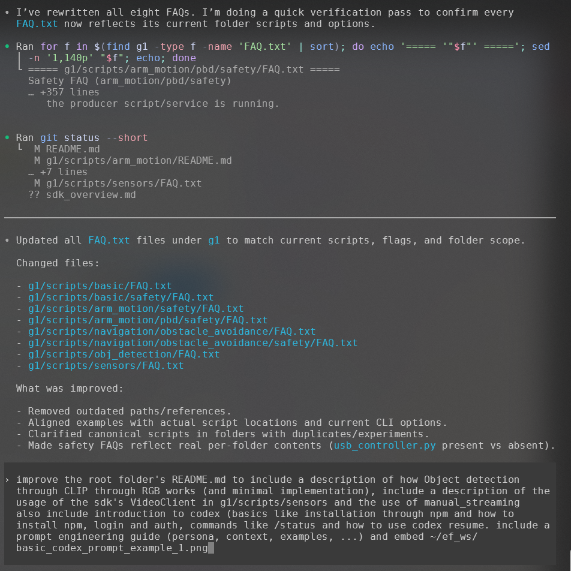
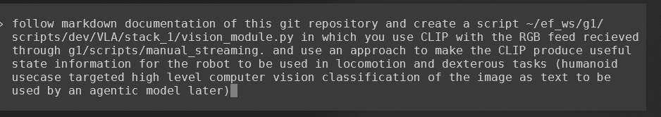

# ef_ws

Workspace for Unitree robots (G1, GO2): runtime scripts, SDK wrappers, SLAM/navigation tools, and MuJoCo simulation.

If you are new to terminal workflows, start with `CLI_basics.md` first, then come back here.

## Repository Layout
- `g1/`: G1 scripts, docs, and simulation assets.
- `go2/`: GO2 scripts and simulation assets.
- `config_ubuntu.bash`: Ubuntu provisioning script.
- `conf_raspi.bash`: Raspberry Pi provisioning variant.
- `links.md`: external references used by setup scripts.
- `sdk_overview.md`: practical Unitree SDK2 Python import and usage guide.

## Quick Start
If you want the fastest repeatable Ubuntu setup:

```bash
export UNITREE_SDK2_REPO=https://.../unitree_sdk2.git
export UNITREE_SDK_PY_REPO=https://.../unitree_sdk2_python.git
sudo bash config_ubuntu.bash
```

## Codex Basics (CLI)
This workspace is set up to work well with Codex for iterative engineering tasks.

### 1) Install Node.js + npm (if missing)
```bash
sudo apt update
sudo apt install -y nodejs npm
node -v
npm -v
```

### 2) Install Codex CLI
```bash
npm install -g @openai/codex
codex --version
```

### 3) Login / auth
Option A (ChatGPT sign-in flow):
```bash
codex --login
```

Option B (API key):
```bash
export OPENAI_API_KEY="<your_key>"
codex
```

### 4) Useful interactive commands
Inside Codex interactive TUI:
- `/status` shows current session config/status.
- `/approvals` configures approval behavior.
- `/model` switches model/reasoning profile.

Resume a prior session from terminal:
```bash
codex resume <session-id>
```

## Prompt Engineering Guide (for Codex)
Use this structure for high-quality results.

### Persona
State who the agent should act as.
- Example: `Act as a senior robotics software engineer focused on safe, testable changes.`

### Context
Provide repo and runtime constraints.
- Example: `Repo root is /home/ag/ef_ws, use g1/scripts/dev/ef_client.py conventions, do not touch unrelated files.`

### Task
Define the concrete outcome.
- Example: `Add a new helper to Robot for safe turn-and-stop, update docs, and include a usage example.`

### Constraints
Define boundaries and acceptance checks.
- Example:
  - `No destructive git commands`
  - `Keep API backward compatible`
  - `Run lint or basic sanity checks after edit`

### Examples
Show desired style or expected output.
- Example: include one target code snippet and one desired CLI invocation.

### Prompt template
```text
Persona:
You are ...

Context:
- Repo:
- Relevant files:
- Runtime assumptions:

Task:
- Implement ...

Constraints:
- ...

Acceptance Criteria:
- ...
```

Prompt example images:




## G1 Entry Point: `ef_client.Robot`
For most real-robot workflows, start with `g1/scripts/dev/ef_client.py` and its `Robot` class.

Typical use (from inside `g1/scripts`):

```python
from dev.ef_client import Robot

robot = Robot(iface="enp1s0", domain_id=0, safety_boot=True)
robot.walk(0.2, 0.0, 0.0)   # balanced gait command
robot.stop()
```

Main method groups:
- Locomotion:
  - `loco_move(vx, vy, vyaw)` for direct velocity command.
  - `walk(...)` and `run(...)` for gait-aware motion commands.
  - `walk_for(distance)` / `run_for(distance)` / `turn_for(angle_deg)` for feedback-guided moves.
  - `stop()` / `stop_moving()`.
- FSM and gait switching:
  - `set_gait_type(0|1 or alias)` for balanced vs continuous gait.
  - `get_fsm()` to inspect current FSM id/mode.
  - `fsm_0_zt()`, `fsm_1_damp()`, `fsm_2_squat()`, `balanced_stand()`, `hanging_boot()`.
- SLAM/navigation:
  - `start_slam(...)`, `stop_slam(...)`.
  - `slam_start()`, `slam_stop()`, `slam_nav_pose(...)`, `slam_nav_path(...)`.
  - `slam_set_path_point(...)`, `navigate_path(...)`, `get_slam_pose(...)`.
- Sensors/state helpers:
  - `get_imu()`, `get_position()`, `get_velocity()`, `get_lidar_points()`, `get_robot_state()`.

See also:
- `g1/scripts/dev/sdk_details.md`
- `g1/scripts/dev/sdk_details_ef_client.md`

## Object Detection Through CLIP (RGB)
`g1/scripts/obj_detection/soda_can_detect.py` uses Unitree `VideoClient` to fetch one RGB frame and classifies it with CLIP zero-shot prompts.

Flow:
1. DDS init on robot NIC (`ChannelFactoryInitialize`).
2. `VideoClient.GetImageSample()` fetches JPEG bytes.
3. OpenCV decodes JPEG to BGR image.
4. CLIP compares image with text prompts (positive vs negative).
5. Softmax score is thresholded (default `--threshold 0.6`).

Minimal implementation pattern:
```python
from unitree_sdk2py.core.channel import ChannelFactoryInitialize
from unitree_sdk2py.go2.video.video_client import VideoClient
import cv2, numpy as np, torch
from transformers import CLIPModel, CLIPProcessor

ChannelFactoryInitialize(0, "eth0")
vc = VideoClient(); vc.SetTimeout(3.0); vc.Init()
code, data = vc.GetImageSample()
frame = cv2.imdecode(np.frombuffer(bytes(data), np.uint8), cv2.IMREAD_COLOR)

model = CLIPModel.from_pretrained("openai/clip-vit-base-patch32")
proc = CLIPProcessor.from_pretrained("openai/clip-vit-base-patch32")
inputs = proc(
    text=["a soda can", "no soda can, an empty scene"],
    images=np.ascontiguousarray(frame[..., ::-1]),
    return_tensors="pt",
    padding=True,
)
with torch.no_grad():
    probs = model(**inputs).logits_per_image.softmax(dim=1)[0]
print(float(probs[0]))  # positive score
```

Canonical command:
```bash
python3 g1/scripts/obj_detection/soda_can_detect.py --iface eth0 --show
```

## `VideoClient` and `manual_streaming` in `g1/scripts/sensors`
`g1/scripts/sensors` supports two camera access modes:

### 1) SDK `VideoClient` snapshots
- Used by `g1/scripts/sensors/rgbd_cam.py` (in `--mode rpc` or `--mode auto` fallback).
- Best for quick remote RGB checks from laptop over robot network.
- Low integration overhead; not intended as high-rate depth stream transport.

### 2) Manual RealSense network streaming (`manual_streaming/`)
- Sender on Jetson: `jetson_realsense_stream.py`
- Receiver on workstation: `receive_realsense_gst.py`
- CLIP overlay receiver: `receive_realsense_gst_clip_can.py`
- Supports continuous RGB + depth visualization over UDP/GStreamer.

Typical workflow:
1. Run sender on Jetson with `--client-ip <PC_IP>`.
2. Run receiver on dev machine.
3. For detection overlays, use the CLIP receiver variant.

## Script Family Highlights
### `g1/scripts/basic/audio/*.py`
Small utility scripts for speaking and recording:
- `text_to_wav.py`: synthesize speech to WAV.
- `greeting.py`: play a predefined greeting clip.
- `record_wav.py`: record audio samples.

### `g1/scripts/basic/headlight_client/*.py`
- `headlight.py`: direct headlight control helper for quick hardware checks.

### `g1/scripts/arm_motion/pbd/*.py`
Programming-by-demonstration (record/replay) workflow:
- `pbd_demonstrate.py`: record arm joint trajectories while manually guiding the robot.
- `pbd_reproduce.py`: replay recorded trajectories from CSV/NPZ.
- `pbd_docs.md`: background notes and file format details.
- `motion_databse/*.csv`: sample recorded motions.

## Environment Setup Checklist (Core)
- [ ] System packages
  - `sudo apt update`
  - `sudo apt install -y build-essential cmake ninja-build pkg-config git curl ca-certificates python3-dev mesa-utils libgl1-mesa-dev libssl-dev tmux`
- [ ] Install `uv`
  - `curl -LsSf https://astral.sh/uv/install.sh | sh`
  - `uv --version`
- [ ] Create Python 3.10 venv
  - `uv venv --python 3.10 ~/.vens/python310`
- [ ] Build/install CycloneDDS
  - `git clone https://github.com/eclipse-cyclonedds/cyclonedds.git ~/cyclonedds`
  - `cd ~/cyclonedds`
  - `cmake -S . -B build -G Ninja -DCMAKE_BUILD_TYPE=Release -DCMAKE_INSTALL_PREFIX=~/cyclonedds/install`
  - `cmake --build build`
  - `cmake --install build`
- [ ] Build/install Unitree SDK2 (C/C++)
  - `git clone <UNITREE_SDK2_REPO> ~/unitree_sdk2`
  - `cd ~/unitree_sdk2`
  - `cmake -S . -B build -G Ninja -DCMAKE_BUILD_TYPE=Release -DCMAKE_INSTALL_PREFIX=~/unitree_sdk2/install`
  - `cmake --build build`
  - `cmake --install build`
- [ ] Install Unitree Python SDK2 wrapper
  - `git clone <UNITREE_SDK_PY_REPO> ~/unitree_sdk_python`
  - `uv pip install --python ~/.vens/python310/bin/python -e ~/unitree_sdk_python`

## Environment Setup Checklist (Livox / SLAM)
- [ ] Build/install Livox-SDK2
  - `git clone https://github.com/Livox-SDK/Livox-SDK2.git ~/Livox-SDK2`
  - `cd ~/Livox-SDK2 && mkdir -p build && cd build`
  - `cmake .. -DCMAKE_BUILD_TYPE=Release`
  - `make -j$(nproc)`
  - `sudo make install`
  - `sudo ldconfig`
- [ ] Optional Livox-SDK (SDK1 fallback)
  - `git clone https://github.com/Livox-SDK/Livox-SDK.git ~/Livox-SDK`
  - `cd ~/Livox-SDK && mkdir -p build && cd build`
  - `cmake .. -DCMAKE_BUILD_TYPE=Release`
  - `make -j$(nproc)`
  - `sudo make install`
  - `sudo ldconfig`
- [ ] Optional OpenPyLivox helper
  - `git clone https://github.com/Livox-SDK/openpylivox.git ~/openpylivox`
  - `uv pip install --python ~/.vens/python310/bin/python -e ~/openpylivox`

## Environment Setup Checklist (MuJoCo)
- [ ] `sudo apt install -y mesa-utils libgl1-mesa-dev`
- [ ] `uv pip install --python ~/.vens/python310/bin/python mujoco`

## Helpful Documentation In This Repo
- CLI basics: `CLI_basics.md`
- SDK guide: `sdk_overview.md`
- G1 docs index: `g1/docs/index.md`
- G1 quick start: `g1/docs/quick_start.md`
- RealSense streaming internals: `g1/docs/how_it_works.md`
- Script overview: `g1/docs/scripts.md`
- Troubleshooting: `g1/docs/troubleshooting.md`
- Geoff stack architecture: `g1/docs/geoff_stack.md`
- `g1/scripts` overview: `g1/scripts/README.md`
- Arm motion notes: `g1/scripts/arm_motion/README.md`
- External links: `links.md`
